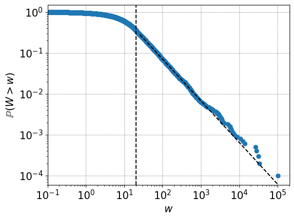

## About
Research interests:
- the income and wealth distribution
- the monetary system 
- power law distributions

<!--  -->

<!--  -->

PhD Mathematics of Systems, University of Warwick, 2022

[CV](https://drive.google.com/file/d/1AScG9Irzva_lSbv93S2_JKajhDKzlt-H/view?usp=share_link) and 
[GitHub](https://github.com/saf92)

Contact: forbessam2@gmail.com

## Research

1. A study of UK household wealth through empirical analysis and a non-linear Kesten process (2022), S. Forbes, S. Grosskinsky, PLoS ONE, [Link](https://doi.org/10.1371/journal.pone.0272864)
3. PhD (2022) titled 'Data driven analysis and modelling of the wealth distribution', supervisors: S. Grosskinsky, A. Karalis Isaac, [Link](https://wrap.warwick.ac.uk/175084/)

